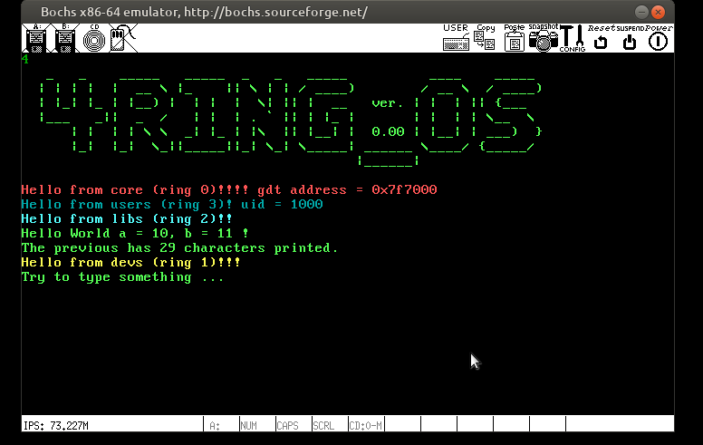
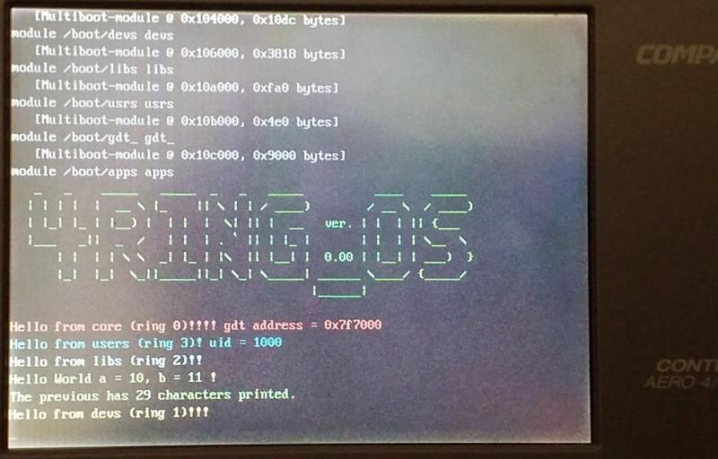

# [4RING_OS](https://www.isoux.org/blog/index.php?article2/4ring_os)

Hobby operating system for Intel processors from 386 and up. Engaged on all 4 rings with call gates, paging, segmentation and almost all hardware capabilities provided by this generation of processors.

For a self-taught person like me, who is still learning to coding, realizing an idea by writing from scratch is not an easy process at all. There is also a fear of failure and ridicule from genius people and professionals. But sincere desire and joy when you master the basic functionality of hardware at least a little, overcomes all obstacles. It is an even greater inspiration that this little work will mean at least something to someone. To be honest, I was seriously surprised when I didn't find a single specific example of code anywhere on the Internet where at least the most brief explanation of the functionality and interaction between the 4 protection rings on Intel processors is documented.

I embarked on an adventure to try to understand this by mostly reading INTEL's technical documentation and studying LINUX from the very first version 0.00. I have spent a lot of time since I started this adventure. I succeeded a bit and new ideas were born. I started writing ugly code mostly in assembler and slowly rewriting it in C language according to the progress of learning. At the lowest level, the code is written from scratch, at higher levels where "OS" works with devices, libraries and user programs, I insert and customize ingenious coding solutions from earlier versions of LINUX and GNU software.

Although this system would be strictly hardware-oriented and not portable, I still have a tendency for this mini "OS" to be similar to unix-like systems and to implement the POSIX standard in it as much as I can.

- [Motivation](https://www.isoux.org/blog/index.php?article3/motivation)
- [Basic Idea and assumptions](https://www.isoux.org/blog/index.php?article4/basic-idea-and-assumptions)
- [Development and tools](https://www.isoux.org/blog/index.php?article5/development-and-tools)
- [Pre-release 0.00](https://www.isoux.org/blog/article6/release-000)

Screenshots:

 from BOCHS

 from COMPAQ contura AERO

## Release 0.00
Finally, after a few months, we came to the first tangible release.

Printc and printr functions have been created to print system alerts and facilitate debugging from all rings. Printc (print core) for kernel at ring 0 and printr (print ring) for others rings. Writing the printf function has opened up engagement on multiple fronts. First I had to start writing a small libc library specific to my environment (4libc) to be able to implement the printf function. I then swiped the function through three rings until the contents were printed on the monitor. I had to learn a lot of mistakes ... The basic functionality has been achieved, and the example of this function shows the interaction from user protection rings through libraries to devices (from ring 3 through 2 to 1). Finally, I wrote a hello world application that loads into ram memory and runs after system initialization, to show if this works.

There is a lot of work to be done to write the existing code more implicitly first and to avoid repeating some functions written in the assembler.
The biggest task is to start writing memory management, implementing a file system, and at the same time expand the basic libc library and add new ones.
It is certainly important to add some new application that proves the functionality of the system.
What you see, I also successfully tested on real 32-bit machines.

In order to be able to use the BOCHS GUI debugger, I had to install an older version because the default version of BOCHS has a problem with the GUI debugger on UBUNTU 20.04. Sometimes the QEMU emulator works great and sometimes it crashes, which confused me, but when I checked the code on a real machine it always worked even though the QEMU showed the opposite. But my goal is not to adapt my code to the QEMU or other emulators, but to the real machines.

&#160;

<h2>&#160;</h2>

&#160;

&#160;

